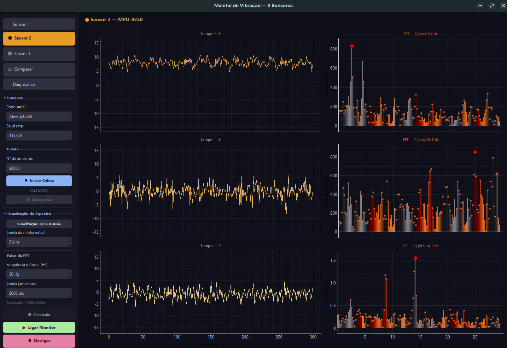
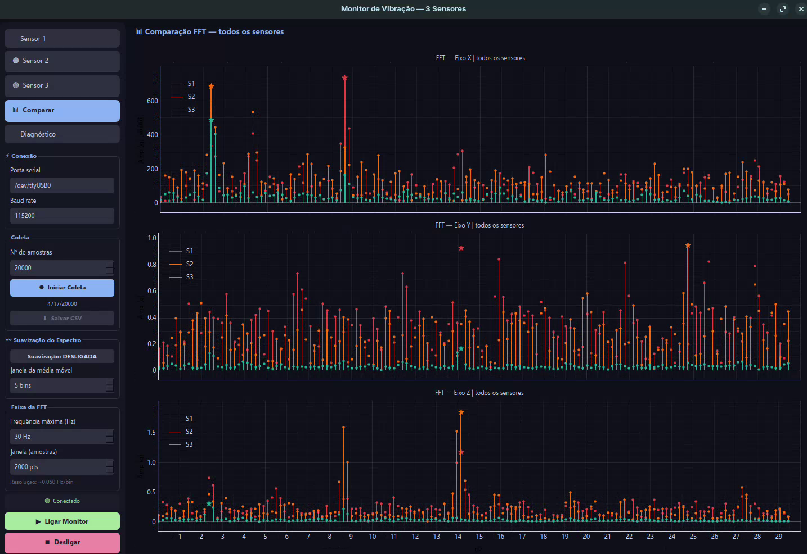
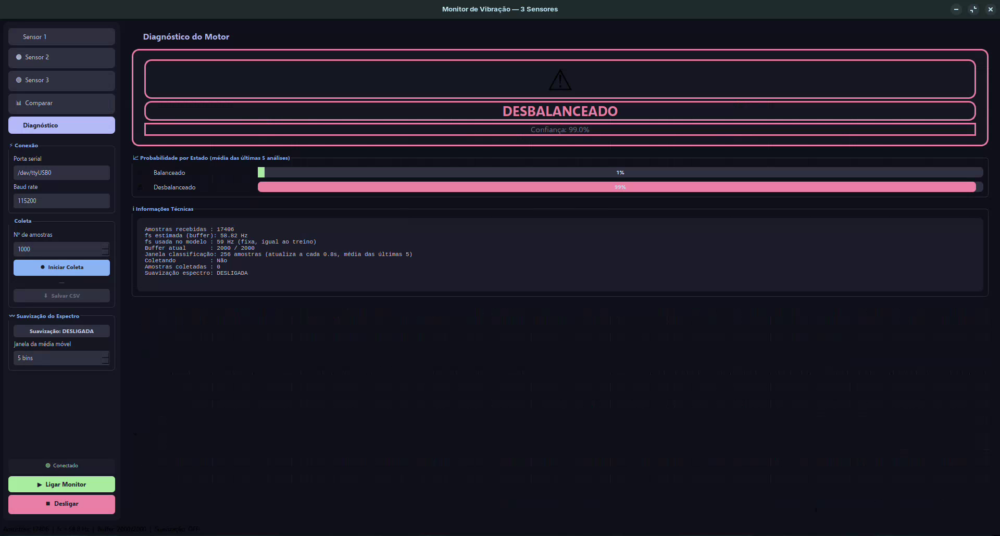

# Classificador de Vibração de Motor por Random Forest

Sistema de monitoramento e diagnóstico de falhas em motores elétricos baseado em sinais de vibração. Coleta dados de três acelerômetros via ESP32, extrai características no domínio do tempo e da frequência e classifica o estado do motor em tempo real com um classificador Random Forest.

Desenvolvido como atividade da disciplina de Engenharia de Manutenção na **Universidade Federal de Pernambuco — Centro Acadêmico do Agreste (UFPE/CAA)**, sob orientação do **Prof. Dr. Thalles Vitelli Garcez** ([Lattes](http://lattes.cnpq.br/1830132039422949)) — docente do Departamento de Engenharia de Produção e coordenador do Programa de Pós-Graduação em Engenharia de Produção (PPGEP/CAA).

---

## Resultados

| Métrica | Valor |
|---|---|
| Acurácia (teste 20%) | **≥ 96%** |
| Validação cruzada (5-fold) | **≥ 95%** |
| Classes | Motor Balanceado · Motor Desbalanceado |
| Features utilizadas | 21 de 108 extraídas |
| Estimadores (Random Forest) | 300 árvores |

---

## Hardware necessário

- **Microcontrolador:** ESP32 (qualquer variante com dois barramentos I²C)
- **Sensores:** 2× MPU-9250 + 1× MPU-6050
- **Conexão:** USB–Serial (115200 baud)

Os três acelerômetros são distribuídos em dois barramentos I²C independentes do ESP32 para contornar a limitação de endereçamento do protocolo. O firmware completo está em [`firmware/firmware_esp32.ino`](firmware/firmware_esp32.ino).

---

## Estrutura do repositório

```
classificador-vibracao-motor/
│
├── dados/
│   ├── motor_balanceado.csv      # motor em condição normal (~1.700 s, 99.999 amostras)
│   ├── motor_desbalanceado.csv   # motor com parafuso de desbalanceamento (~1.700 s, 99.999 amostras)
│   └── README.md                 # descrição detalhada dos dados
│
├── firmware/
│   └── firmware_esp32.ino        # firmware ESP32: leitura dos 3 IMUs + transmissão serial CSV
│
├── modelos/
│   └── modelo_rf.pkl             # modelo Random Forest treinado (pronto para uso)
│
├── screenshots/
│   ├── 01_sensor_individual.png  # aba de visualização individual de um sensor
│   ├── 02_comparacao_fft.png     # aba de comparação do espectro FFT entre os 3 sensores
│   └── 03_diagnostico.png        # aba de diagnóstico com a classificação em tempo real
│
├── scripts/
│   ├── 01_selecao_features.py    # Seleção Gulosa (SFS): encontra as 21 melhores features
│   ├── 02_treinar_modelo.py      # treino do Random Forest final com as 21 features
│   ├── 03_avaliar_modelo.py      # gera curva ROC, matriz de confusão e importância
│   └── 04_monitor_vibracao.py    # aplicação desktop de monitoramento em tempo real
│
├── README.md
├── requirements.txt
├── .gitignore
└── LICENSE
```

---

## Instalação

### Dependências Python

```bash
pip install -r requirements.txt
```

### Dependências do firmware

Instalar via **Arduino Library Manager**:
- `FastIMU` (leitura dos MPU-9250)
- `Wire` (inclusa na ESP32 Arduino Core)

---

## Fluxo de uso

O projeto segue um pipeline de quatro etapas numeradas. Se quiser apenas usar o modelo já treinado, pule direto para o passo 4.

### Passo 1 — Seleção de características (opcional)

Executa a Seleção Sequencial Progressiva (SFS) sobre os dados brutos para identificar o subconjunto ótimo de features. Demora alguns minutos.

```bash
cd scripts
python 01_selecao_features.py
```

**Saídas geradas:** `selecao_gulosa_resultado.csv`, `selecao_gulosa_curva.png`, `subset_otimo.csv`

### Passo 2 — Treino do modelo

Treina o Random Forest com as 21 features selecionadas e gera os artefatos do modelo.

```bash
# Os arquivos motor_balanceado.csv e motor_desbalanceado.csv devem estar
# na mesma pasta que o script, ou ajuste o dicionário ARQUIVOS no código.
cd scripts
python 02_treinar_modelo.py
```

**Saídas geradas:** `modelo_rf.pkl`, `label_encoder.pkl`, `features_selecionadas.pkl`, `matriz_confusao.png`, `relatorio_classificacao.txt`

### Passo 3 — Avaliação (opcional)

Gera visualizações detalhadas do modelo treinado: curva ROC, matriz de confusão normalizada e importância das features.

```bash
cd scripts
python 03_avaliar_modelo.py
```

**Saídas geradas:** `curva_roc.png`, `matriz_confusao.png`, `importancia_features.png`

### Passo 4 — Monitoramento em tempo real

Abre a aplicação desktop. Coloque os arquivos `.pkl` na mesma pasta que o script (ou na raiz do projeto) antes de iniciar.

```bash
cd scripts
python 04_monitor_vibracao.py
```

Na interface:
1. Informe a **porta serial** do ESP32 (ex.: `/dev/ttyUSB0` no Linux, `COM3` no Windows)
2. Clique em **Ligar Monitor**
3. Navegue pelas abas dos sensores para visualizar os sinais em tempo real
4. Abra a aba **Diagnóstico** para ver a classificação automática do estado do motor

#### Telas da aplicação

| Sensor individual | Comparação FFT | Diagnóstico |
|---|---|---|
|  |  |  |

---

## Dados

Ver [`dados/README.md`](dados/README.md) para descrição completa do formato, condições de coleta e como gerar novos dados com o firmware.

---

## Licença

MIT — veja [LICENSE](LICENSE).
